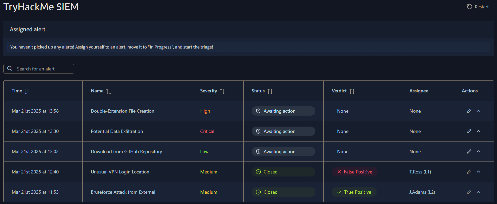
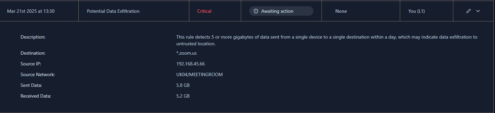
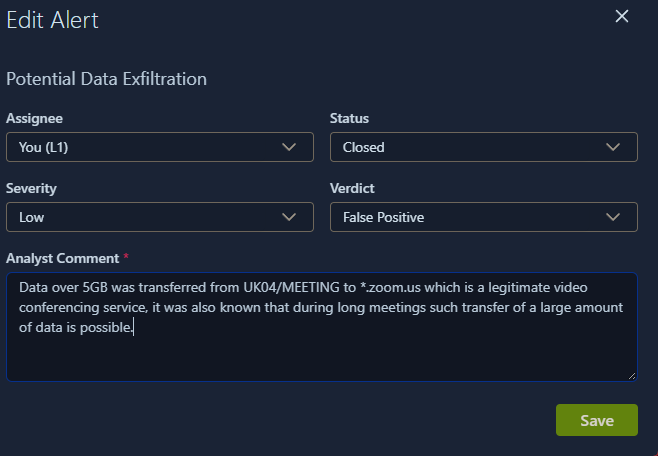
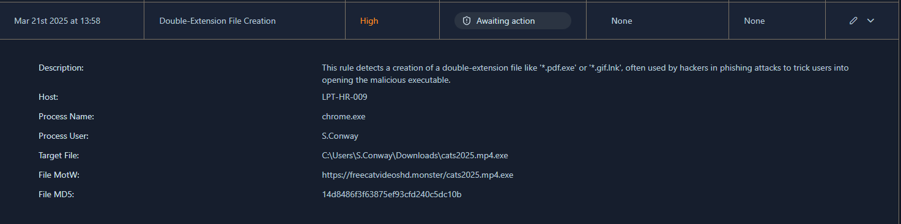
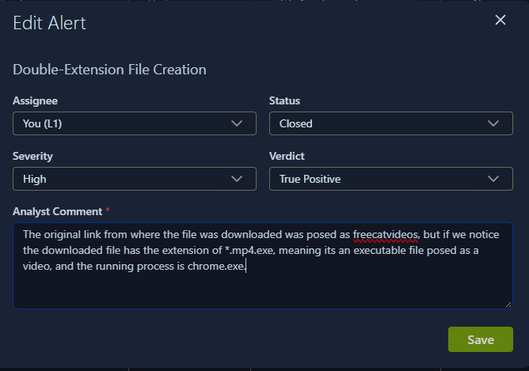
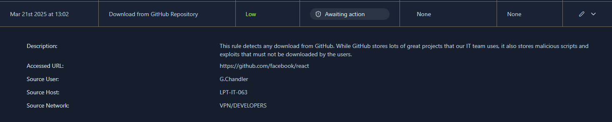
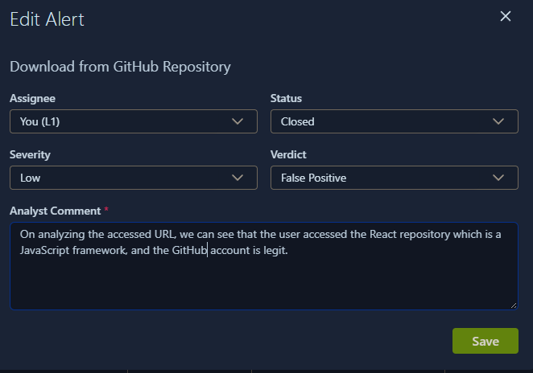

# SOC L1 Alert Triage

**Category:** SOC / Blue Team
**Platform:** TryHackMe
**Difficulty:** Easy

## Room Overview

A simulated SOC dashboard containing 5 alerts. The room walks through reading alert properties, prioritising alerts by severity and recency, and triaging each alert to a verdict.

## Solution

### Task 1: Dashboard

Opened the [SOC dashboard](https://static-labs.tryhackme.cloud/apps/socl1-alerttriage/) and counted the alerts listed, then checked which was most recent.



- **Q:** Number of alerts on the dashboard?  
  **A:** `5`
- **Q:** Name of the most recent alert?  
  **A:** `Double-Extension File Creation`

---

### Task 2: Alert Properties

Expanded the "Unusual VPN Login Location" alert to inspect its full properties (verdict and associated user).

- **Q:** Verdict for the "Unusual VPN Login Location" alert?  
  **A:** `False Positive`
- **Q:** User mentioned in the "Unusual VPN Login Location" alert?  
  **A:** `M.Clark`

---

### Task 3: Alert Prioritisation

Reasoned through prioritisation logic before touching any alert.

- **Q:** Prioritise medium over low severity alerts?  
  **A:** `Yea`
- **Q:** Take newest alerts before older ones?  
  **A:** `Nay`

**Task:** Assign yourself to the first-priority alert and set status to In Progress.

Highest severity (Critical) alert was selected first, ahead of anything lower regardless of timestamp.

- **Q:** Name of the selected alert?  
  **A:** `Potential Data Exfiltration`

---

### Task 4: Alert Triage

Three alerts triaged in priority order — details reviewed first, then a verdict assigned with justification.

#### Alert 1: Potential Data Exfiltration

**Process:**
- **Rule:** 5+ GB sent from a single device to a single destination in a day
- **Destination:** `*.zoom.us`
- **Source IP:** `192.168.45.66`
- **Source Network:** `UK04/MEETINGROOM`
- **Sent:** 5.8 GB | **Received:** 5.2 GB



`*.zoom.us` is a legitimate video conferencing domain, and 5–6 GB of bidirectional traffic is normal for a long video call. No indicator of exfiltration to an untrusted destination.

- **Verdict:** False Positive — Severity downgraded to Low
- **Comment:** Data over 5GB was transferred from UK04/MEETING to *.zoom.us, a legitimate video conferencing service. Large data transfers are expected during long meetings.



**Flag:**
```
THM{looks_like_lots_of_zoom_meetings}
```

#### Alert 2: Double-Extension File Creation

**Process:**
- **Rule:** Detects double-extension files (e.g. `*.pdf.exe`, `*.gif.lnk`)
- **Host:** `LPT-HR-009`
- **Process:** `chrome.exe`
- **User:** `S.Conway`
- **Target File:** `C:\Users\S.Conway\Downloads\cats2025.mp4.exe`
- **Source URL:** `https://freecatvideoshd.monster/cats2025.mp4.exe`
- **MD5:** `14d8486f3f63875ef93cfd240c5dc10b`



The file's real extension is `.exe`, masked behind a fake `.mp4` name, downloaded via Chrome from a suspicious, unofficial-looking domain. Classic double-extension phishing pattern used to trick a user into running a malicious executable.

- **Verdict:** True Positive — Severity kept at High
- **Comment:** The original link was disguised as "freecatvideos," but the downloaded file has the extension *.mp4.exe — an executable posing as a video — and the running process is chrome.exe.



**Flag:**
```
THM{how_could_this_user_fall_for_it?}
```

#### Alert 3: Download from GitHub Repository

**Process:**
- **Rule:** Flags any download from GitHub (legit tooling + potential malicious scripts)
- **Accessed URL:** `https://github.com/facebook/react`
- **Source User:** `G.Chandler`
- **Source Host:** `LPT-IT-063`
- **Source Network:** `VPN/DEVELOPERS`



The URL resolves to Facebook's official react repository — a well-known, legitimate open-source JavaScript framework — accessed by a developer over the VPN developer network. No sign of malicious tooling.

- **Verdict:** False Positive — Severity kept at Low
- **Comment:** On analyzing the accessed URL, the user accessed the React repository, which is a legitimate JavaScript framework, and the GitHub account is legit.



**Flag:**
```
THM{should_we_allow_github_for_devs?}
```

## Takeaway

Severity labels alone don't decide a verdict — context does. Source/destination reputation, process lineage, and file naming patterns (e.g. a hidden `.exe` behind a fake `.mp4`) are what separate normal business traffic from an actual compromise. The one true positive here was caught by spotting a double extension, not by the alert's default severity rating.
